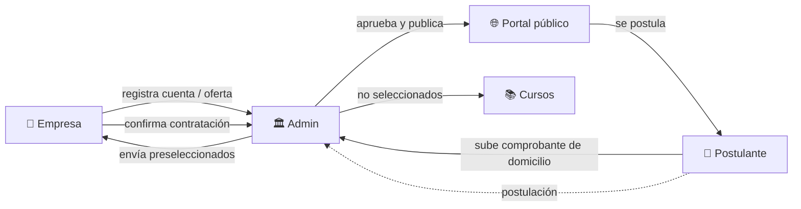

# Portal Municipal de Empleo — Funes

Portal web para la **Oficina de Empleo de la Municipalidad de Funes** (Santa Fe, Argentina), desarrollado en el marco del programa **Funes Tech Lab**.

Conecta a vecinos que buscan trabajo con empresas de la zona, manteniendo a la Oficina de Empleo como intermediaria en todo el proceso.

> 🚧 **Estado:** MVP en desarrollo — ver [`docs/ROADMAP.md`](docs/ROADMAP.md) para el avance por fases.

---

## El problema

Hoy la oficina recibe los CVs en papel o por mail y los carga a mano en Excel. Los currículums quedan desordenados por rubro, cuesta filtrarlos y no hay forma simple de medir resultados.

## La solución

Un portal digital con tres roles, donde **cada uno tiene una función clara** y la oficina mantiene el control de calidad y el contacto humano (preentrevista, seguimiento, acompañamiento).

| Rol | Puede |
|-----|-------|
| 👤 **Postulante** | Registrarse, armar su CV (en la plataforma o subiendo un PDF), elegir varios rubros, verificar su domicilio en Funes, postularse y seguir el estado de sus postulaciones. |
| 🏢 **Empresa** | Registrarse (queda pendiente de verificación), cargar ofertas, recibir candidatos preseleccionados y registrar contrataciones. |
| 🏛️ **Admin** (Oficina de Empleo) | Aprobar empresas, ofertas y domicilios; preseleccionar postulantes; buscar perfiles; ver indicadores; hacer seguimiento, derivar a cursos y dar de alta otros admins. |

## Flujo de negocio



**Regla central:** postulante y empresa nunca interactúan directo; todo pasa por la Oficina de Empleo.

---

## Stack

| Capa | Tecnología |
|------|-----------|
| Framework | [Next.js 16](https://nextjs.org/) (App Router) + React 19 |
| Lenguaje | TypeScript |
| Estilos | Tailwind CSS v4 + [shadcn/ui](https://ui.shadcn.com/) (Base UI) |
| Base de datos / Auth / Storage | [Supabase](https://supabase.com/) (PostgreSQL) |
| Deploy | Vercel |

---

## Cómo correrlo

### Requisitos

- Node.js 20 o superior
- Git
- Un proyecto en Supabase (pedir acceso al equipo)

### Instalación

```bash
# 1. Clonar el repo
git clone https://github.com/KevinKener/portal-empleo-funes.git
cd portal-empleo-funes

# 2. Instalar dependencias
npm install

# 3. Configurar variables de entorno
cp .env.example .env.local
# completar .env.local con los datos del proyecto de Supabase

# 4. Levantar el servidor de desarrollo
npm run dev
```

Abrí [http://localhost:3000](http://localhost:3000).

### Variables de entorno

| Variable | Dónde se usa | Descripción |
|----------|-------------|-------------|
| `NEXT_PUBLIC_SUPABASE_URL` | Cliente y servidor | URL del proyecto de Supabase |
| `NEXT_PUBLIC_SUPABASE_PUBLISHABLE_KEY` | Cliente y servidor | Clave pública (publishable) de Supabase |

> ⚠️ `.env.local` **nunca** se sube al repo. Si agregás una variable nueva, sumala a `.env.example` (sin valor) y a esta tabla.

### Scripts

```bash
npm run dev      # desarrollo con recarga automática
npm run build    # build de producción
npm run start    # correr el build
npm run lint     # revisar el código con ESLint
```

### Base de datos (migraciones)

El esquema vive en `supabase/migrations/` y los datos de demo en `supabase/seed.sql`. Usamos el CLI de Supabase con `npx` (no hace falta instalarlo):

```bash
npx supabase login                          # una sola vez, abre el navegador
npx supabase link --project-ref <ref>       # <ref> está en la URL del proyecto en Supabase
npx supabase db push --include-seed         # aplica migraciones pendientes + seed
npx supabase gen types typescript --linked --schema public > src/types/database.ts  # regenera los tipos
```

- Nunca cambiar tablas desde el dashboard sin crear la migración correspondiente.
- Después de cada migración, regenerar `src/types/database.ts` (no se edita a mano).
- Los estados y sus transiciones se consultan en `src/lib/estados.ts` (`puedeCambiarEstado`, `siguientesEstados`); no escribir estados sueltos en el código.
- **Cuenta Admin inicial:** crearla en *Authentication → Users → Add user* (sin metadata) y después, en el *SQL Editor*:
  `insert into public.perfiles (id, rol) values ('<id del usuario>', 'admin');`
  Los demás Admins se crean desde la app (regla 7).
- Ojo: `postulaciones.notas_admin` es solo para Admins. Al consultar `postulaciones` hay que listar las columnas (`select('*')` da error de permisos); los Admins usan la vista `postulaciones_admin`.

---

## Estructura

```
src/
├── app/          # Rutas (cada carpeta con page.tsx es una URL) y API (route.ts)
├── components/   # ui/ (shadcn) + componentes propios por dominio
├── hooks/        # Custom hooks de cliente
├── lib/          # Supabase, validaciones, estados y utilidades
└── types/        # Tipos generados desde la base
supabase/         # Migraciones y datos de prueba
docs/             # Roadmap, guía de Next.js y material del proyecto
```

### Rutas

| URL | Descripción |
|-----|-------------|
| `/` | Página principal |
| `/ofertas` | Listado de ofertas publicadas |
| `/ofertas/[id]` | Detalle de una oferta |
| `/empresa` | Panel de empresa |
| `/admin` | Panel de la Oficina de Empleo |
| `/saludo` · `/api/saludo` | Ejemplo didáctico de Client Component + API |

---

## Cómo trabajamos

- **Ramas:** `main` siempre estable. Una rama por tarea: `feature/…`, `fix/…`, `docs/…`.
- **Commits:** en español con [Conventional Commits](https://www.conventionalcommits.org/es/) → `feat: agrega listado de ofertas`.
- **Integración:** Pull Request revisado por el compañero antes de mergear.
- **Convenciones de código y reglas de negocio:** [`AGENTS.md`](AGENTS.md).
- **Trabajo con Claude Code:** [`CLAUDE.md`](CLAUDE.md).

## Documentación

| Documento | Para qué |
|-----------|----------|
| [`docs/ROADMAP.md`](docs/ROADMAP.md) | Fases, tareas y estado actual |
| [`docs/guia-nextjs.md`](docs/guia-nextjs.md) | Guía práctica de Next.js 16 para el equipo (rutas, componentes, API, Git) |
| [`AGENTS.md`](AGENTS.md) | Reglas de negocio, seguridad y convenciones (en inglés, para agentes de IA) |
| [`docs/research/`](docs/research/) | Investigaciones técnicas (ej.: notificaciones por email) |

---

## Equipo

Proyecto desarrollado en el programa **Funes Tech Lab** (Municipalidad de Funes).

- Maximo Reyes Pellizzer — [@Rpellizz1](https://github.com/Rpellizz1)
- Kevin Kener — [@KevinKener](https://github.com/KevinKener)

Tutor: Elías Gallay